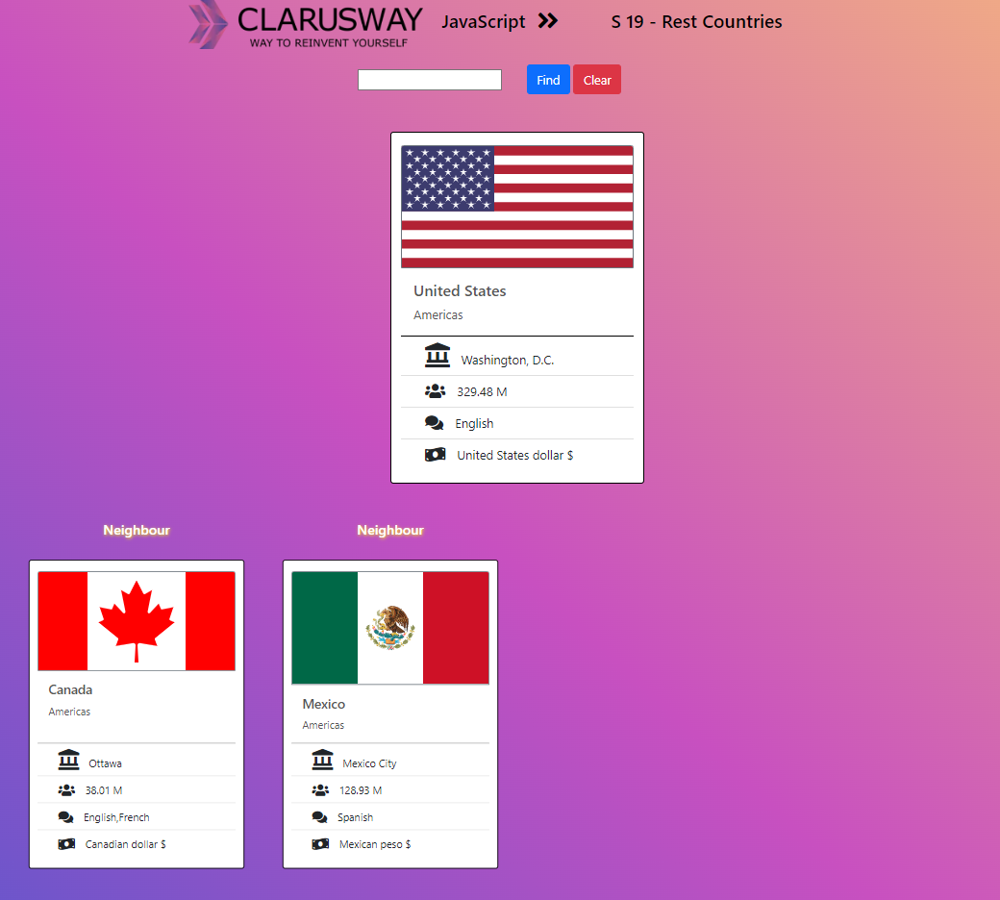

## REST Countries App

## Description

This project aims to fetch data from a third party api named "Rest Countries" and display the retrieved data in a fashioned way.

There are many public free api providers. Please see [Public APIs](https://github.com/public-apis/public-apis)

You can country data from [rest countries API](https://restcountries.com/). Please read the documentation how to use this API and get data of a country.

## Session Objectives

At the end of class session you will learn,

- how to use `fetch` or `axios` to get json data from an api endpoint,
- how async functions works in `async/await` syntax,
- how to parse json data and display to the DOM

## Project Skeleton

```
restCountries(folder)
|
|----readme.md         # Given to the students (Definition of the project)
|----preview
        |----index.html
        |----style.css
        |----index.js
```

## Expected Outcome



### At the end of the project, students will be able to;

- improve coding skills within HTML & CSS & JS

- comprehend asynchronous programming concepts with a hands-on class.

<center> ⌛ Happy Coding  ✍ </center>
